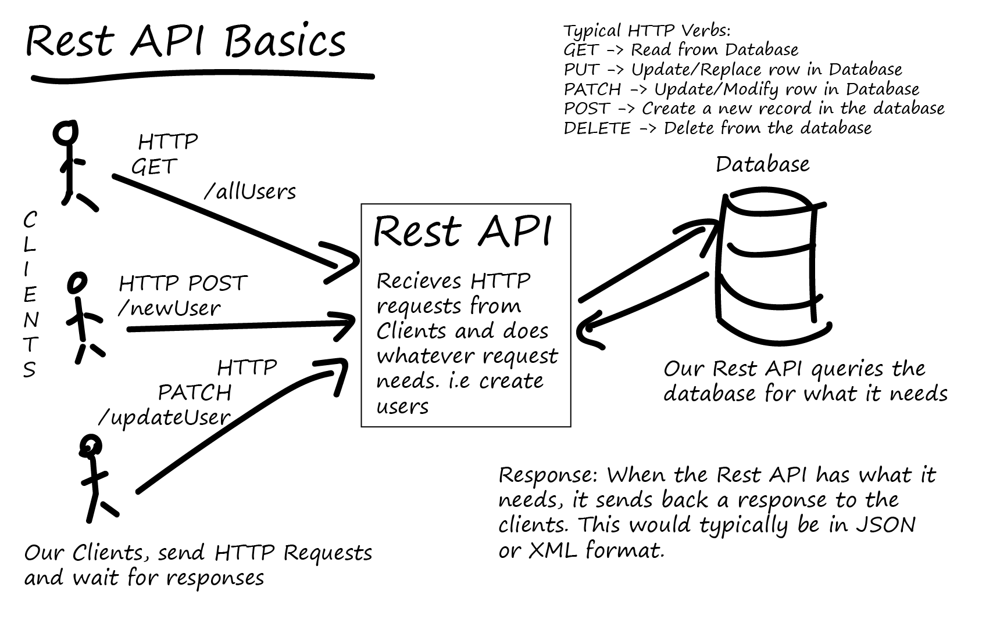
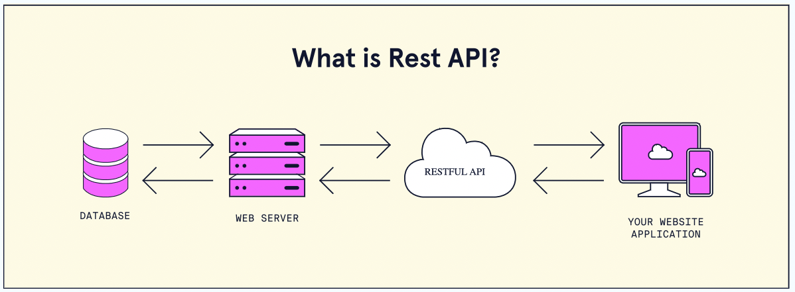
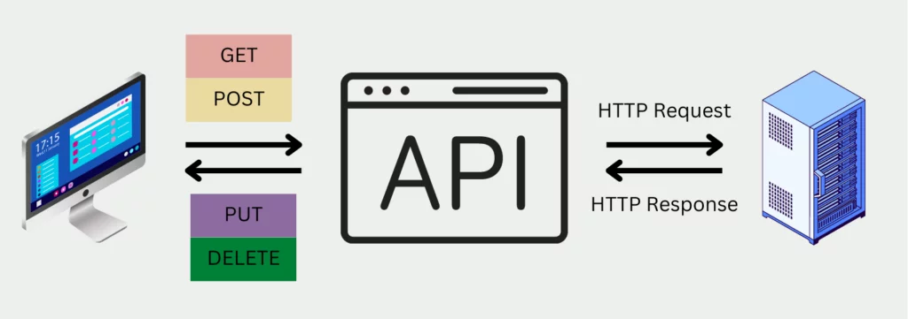

# REST API Project Documentation (Updated)

This document explains:

1. The REST API concept using your attached diagrams
2. What we implemented in this project end-to-end
3. How each feature works (backend + frontend)
4. How to test and use all APIs

---

## 1) REST API concept explained using your images

### Diagram A — REST API Basics (client → API → database)

### What this shows

- **Clients** (web/mobile/app users) send HTTP requests.
- The **REST API server** receives requests and applies business logic.
- The API talks to the **database** to read/write data.
- API returns a **response** (usually JSON) back to clients.

### HTTP verbs from this diagram

- `GET` → Read data
- `POST` → Create data
- `PATCH` / `PUT` → Update data
- `DELETE` → Remove data

This exactly matches your Product API flow in this project.

---

### Diagram B — What is REST API? (website app ↔ REST API ↔ web server/database)

### What this shows

- Your **website application** does not directly manage database rows.
- It calls a **RESTful API** endpoint.
- The API layer communicates with server/database and returns structured responses.
- This keeps responsibilities clean:
  - frontend = UI/UX
  - backend API = data + rules + security

In your project, this is implemented by:

- Frontend: `public/index.html`, `public/script.js`
- Backend: `server.js`
- Data: SQLite `data/restapi.db`

---

### Diagram C — HTTP request/response and CRUD verbs

### What this shows

- Client sends an **HTTP Request** to API.
- API performs work (including DB operations).
- API sends **HTTP Response** back.
- Different HTTP methods represent CRUD operations.

In your project, this maps to:

- `GET /api/products`
- `POST /api/products`
- `PUT /api/products/:id`
- `PATCH /api/products/:id`
- `DELETE /api/products/:id`

---

## 2) What we implemented in this project

### Core REST API (Product)

- Full CRUD for products
- Validation for name/category/price/description
- Search, filtering, sorting, pagination
- Consistent error JSON format

### Local database

- SQLite database in `data/restapi.db`
- Auto table creation on startup
- Seed endpoint for demo data

### Frontend app

- Create product form
- Product list with search/sort
- Edit details / patch price / delete
- API response debug panel

### E-commerce concept pages

- Separate page: before loading state (skeleton)
- Separate page: after loading state (API data cards)

### UI modernization

- Premium typography with Google fonts
- Updated color palette and card style
- Product cards with Pexels category images
- GSAP intro animations

### Transfer Center features

- Upload photo/video/document to server
- List uploaded files with links
- Create DB backups
- List and download backups
- View recent API logs

---

## 3) Backend API reference (current)

## Health and Seed

- `GET /api/health`
- `POST /api/seed`

## Product APIs

- `GET /api/products`
- `GET /api/products/:id`
- `POST /api/products`
- `PUT /api/products/:id`
- `PATCH /api/products/:id`
- `DELETE /api/products/:id`

## Transfer APIs

- `POST /api/transfer/upload` (multipart file field: `file`)
- `GET /api/transfer/files`
- `POST /api/transfer/backup/create`
- `GET /api/transfer/backups`
- `GET /api/transfer/logs?limit=80`

## Static file routes

- `/uploads/*` for uploaded files
- `/backups/*` for generated backups

---

## 4) Frontend architecture mapping

### Main page

- File: `public/index.html`
- Script: `public/script.js`
- Style: `public/styles.css`

### Concept pages

- `public/ecommerce-concept.html`
- `public/ecommerce-before-loading.html`
- `public/ecommerce-after-loading.html`
- `public/ecommerce-after-loading.js`
- `public/ecommerce-concept.css`

---

## 5) Data/flow lifecycle in your app

1. Browser UI sends `fetch()` request
2. Express route in `server.js` handles request
3. Backend validates payload/query
4. SQLite query runs (`run/get/all` wrappers)
5. API returns JSON response + status code
6. Frontend updates DOM and shows results
7. Request logging middleware writes line to `logs/access.log`

---

## 6) Upload, logs, backup behavior

### Upload

- Uses `multer` with mime-based destination buckets:
  - images → `uploads/photos`
  - videos → `uploads/videos`
  - docs → `uploads/documents`

### Logs

- Middleware logs each request to `logs/access.log`
- Logs endpoint returns recent lines as JSON

### Backup

- Backup endpoint copies current DB into `backups/`
- Backup list endpoint exposes downloadable links

---

## 7) How to run and verify

1. Install deps: `npm install`
2. Start app: `npm start`
3. Open: `http://localhost:3000`
4. Optional: click **Insert Sample Data**
5. Verify features:
   - Create/edit/delete product
   - Transfer uploads
   - Create backup
   - Load logs

---

## 8) Notes and best-practice reminders

- JSON APIs should keep response shape consistent.
- Use status codes meaningfully (`201`, `204`, `400`, `404`, `500`).
- For production, tighten CORS and add auth + rate limits.
- Keep backup and upload directories monitored and secured.

---

## 9) Summary

Using your diagrams, this project now demonstrates the full REST API story:

- Conceptual architecture (client ↔ API ↔ database)
- Practical backend implementation (Node.js + Express + SQLite)
- Real frontend integration
- File transfer + logs + backup workflows

This is a complete learning-friendly REST API implementation with documentation aligned to what you built.
